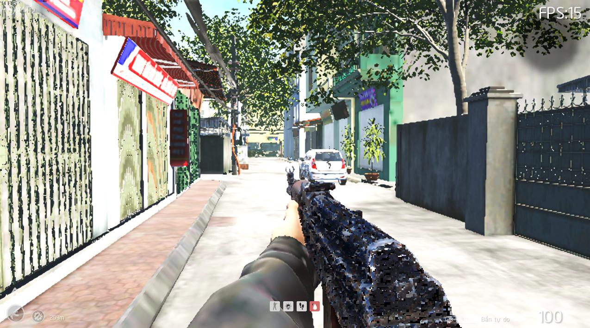
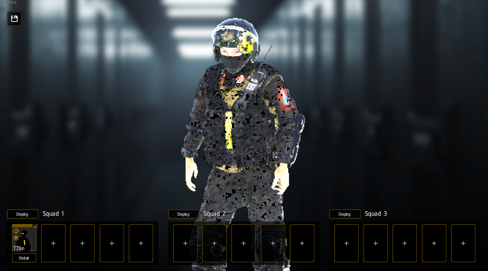
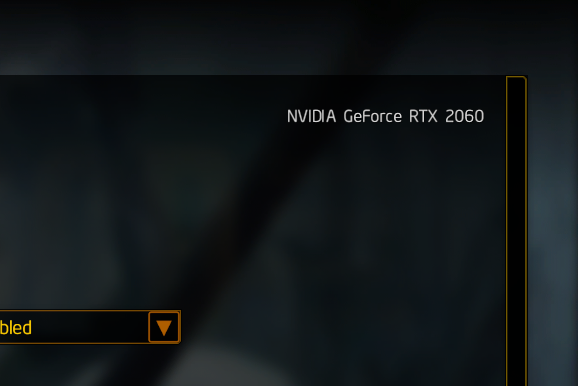
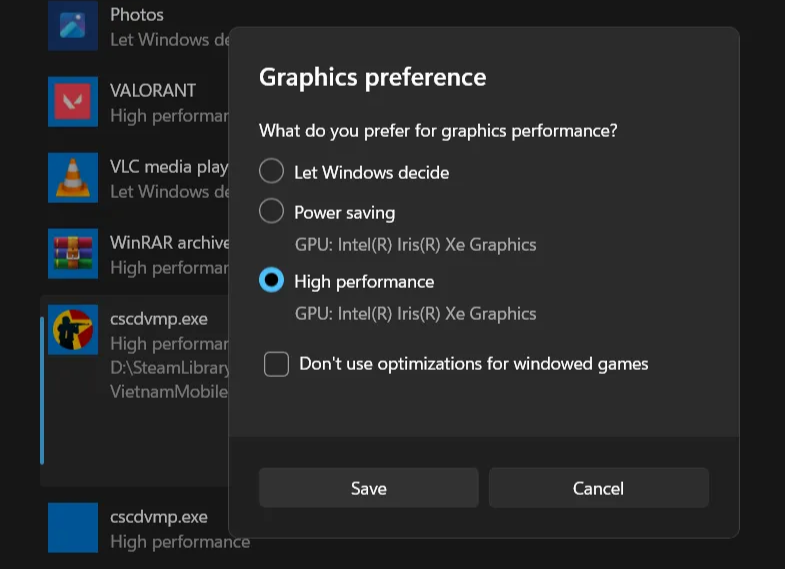

## Problem

During your gaming experience, you may encounter some graphics-related issues. This article will help you resolve them.

The most common issue is **render glitches and extremely low FPS**. Even if your computer has a high-performance graphics card like Nvidia and you're using the lowest settings, the game may still deliver unplayable performance.

 

The reason for this is that your system has **two graphics cards**: one is a dedicated card, such as Nvidia, while the other is an integrated onboard card like Intel HD Graphics. Windows may have automatically chosen to use the onboard card for the game instead of the dedicated one.

## How to fix

- First, launch the game and navigate to **Options > Graphics**. Check the name of the graphics card that the game is using to ensure that it is selecting the correct card.

- If it is not, go to Windows Graphic Settings then manually add the .exe file of the game by using the "Add desktop app" button. For Steam users, it is located in `SteamLibrary\steamapps\common\CSCD Vietnam Mobile Police Demo\cscdvmp.exe`
- Select the correct dedicated card for the file.
- Restart the game to see if it changes.

 

If you need more help, please visit [our forum](https://discord.com/channels/535296218113245206/1379137044370030793).
