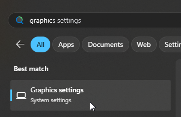

## Vấn đề

Trong quá trình chơi game, bạn có thể gặp một số vấn đề liên quan đến đồ họa. Bài viết này sẽ giúp bạn khắc phục chúng.

Vấn đề phổ biến nhất là **lỗi kết xuất (render glitches) và FPS cực kỳ thấp**. Ngay cả khi máy tính của bạn có card đồ họa hiệu suất cao như Nvidia và bạn đang sử dụng cài đặt thấp nhất, trò chơi vẫn có thể gặp tình trạng hiệu suất không thể chơi được.

 

Lý do cho điều này là hệ thống của bạn có hai card đồ họa: một là card rời (dedicated card), chẳng hạn như Nvidia, trong khi cái còn lại là card tích hợp trên bo mạch (onboard card) như Intel HD Graphics. Windows có thể đã tự động chọn sử dụng card tích hợp cho trò chơi thay vì card rời.

## Cách xử lý

- Đầu tiên, hãy khởi động trò chơi và truy cập mục **Tùy chọn (Options) > Đồ họa (Graphics)**. Kiểm tra tên card đồ họa mà trò chơi đang sử dụng để đảm bảo rằng nó đang chọn đúng card.

- Nếu không đúng card đồ họa, hãy truy cập **Cài đặt Đồ họa của Windows (Windows Graphic Settings)** rồi thêm thủ công tệp **.exe** của trò chơi bằng cách sử dụng nút **Add desktop app**. Đối với người dùng Steam, tệp này thường nằm ở đường dẫn `SteamLibrary\steamapps\common\CSCD Vietnam Mobile Police Demo\cscdvmp.exe`
- Chọn đúng card đồ họa rời cho tệp này.
- Khởi động lại trò chơi.

 
